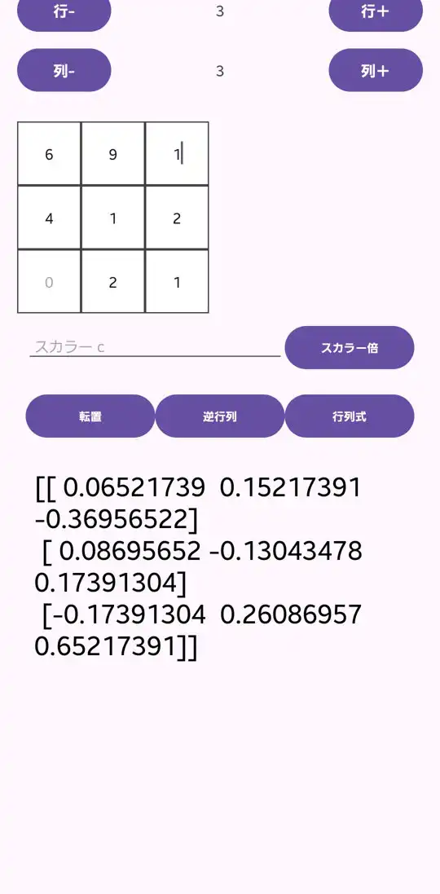

# Android‑Matrix App

Android Studio（Kotlin）と Chaquopy（Python）で実装した、行列計算アプリです。  
スカラー倍・転置・逆行列・行列式など、多目的に使える UI を備えています。

## 技術スタック

- **Kotlin**（Android アプリ本体）  
- **Chaquopy** （Python 実行環境）  
- **NumPy** （行列演算）  
- **Android UI**：動的な GridLayout、各種ボタン・Input 付き  

## セットアップ方法

1. リポジトリをクローン  
   ```bash
   git clone https://github.com/あなた/リポジトリ名.git
   cd リポジトリ/programs/android-matrix

2. Android Studio でフォルダを開く

3. `build.gradle` にて Chaquopy と ABI 設定を確認

4. Python スクリプト `calc/calc_matrix.py` が動くか確認

5. エミュレータまたは実機ですぐ起動可能

## フォルダ構成

```
programs/
└ android-matrix/
    ├ app/                   ← Android Studio のプロジェクト
    └ calc/                 ← Python 行列ロジック（calc_matrix.py）
```

## テスト環境

このアプリは以下の環境でUSBデバッグにより動作確認済みです。

| 項目                | 内容                                       |
|---------------------|--------------------------------------------|
| デバイス             | Galaxy S21（実機）                         |
| Android バージョン   | Android 15（API 35）                       |
| USBデバッグ         | 有効                                       |
| テスト方法           | Android Studio から「Run」で実行           |
<<<<<<< HEAD


## スクリーンショット

逆行列を計算している様子


